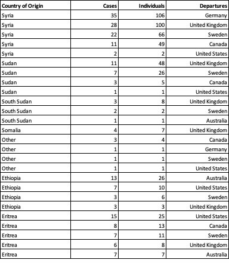
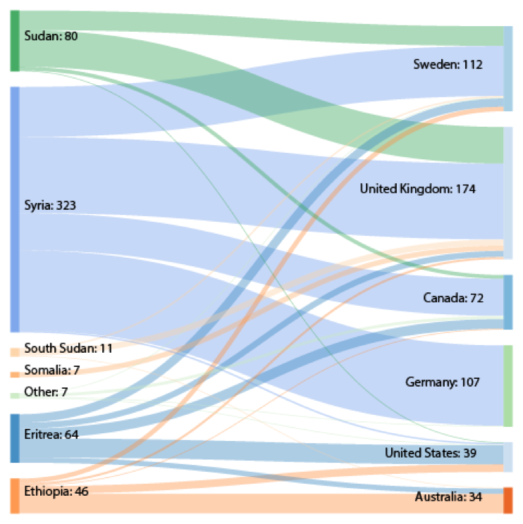
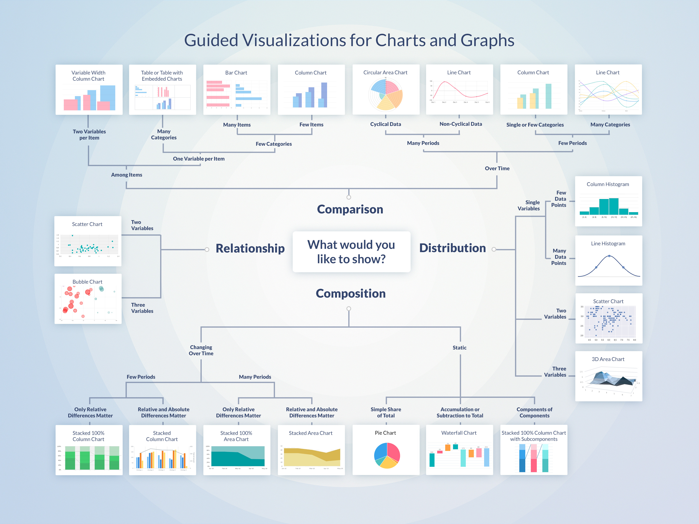

# Data Viz
-------
### Visual Communications for Reporting & Social Media 

Vibek Raj Maurya // UNHCR Egypt

---

## INTRODUCTION
------

### WHO?
* Associate Data Analyst, UNHCR Egypt

### WHAT?
* Synthesise data
* Analyse and present

---

## WHY ARE WE HERE
-----

* We sift through a lot of data for our jobs <!-- .element: class="fragment appear" -->
* We transform the data to a meaningful design <!-- .element: class="fragment appear" -->
* We present them in various medium & platforms <!-- .element: class="fragment appear" --> 

Note: Question the audience on the type and volume of the data they deal with and the WORKFLOW

---
## Data Visualition

It involves interpreting data simple and easy to understand information through visuals

----
### A picture is worth a thousand words

----

<section>
    
 
</section>

Note: 450 words. bit.ly/cwc2019_01

----

<section>
   
</section>

---

## WHY DATA VIZ IS IMPORTANT

Helps us to think and communicate

* Reader-friendliness<!-- .element: class="fragment appear" -->
* Time limitations<!-- .element: class="fragment appear" -->
* Shareability/Engagment<!-- .element: class="fragment appear" -->
* Language barriers<!-- .element: class="fragment appear" -->

Note: nepal in data

----

<section>
   
</section>

---

## MATRAS OF EFFECTIVE VISUALISATION

* What is the story your data is trying to tell?<!-- .element: class="fragment appear" -->
* What type of data do you want to explain?<!-- .element: class="fragment appear" -->
* Which visualisation explains your data effectively?<!-- .element: class="fragment appear" -->
* Who are your target audience?<!-- .element: class="fragment appear" -->

----

### What is your story

All data tells a story. Data visualisation makes the story easy to understand.
<section>
   <!-- .element: class="fragment appear" -->
</section>

*Is population increasing? How did the indicators perform?*<!-- .element: class="fragment appear" -->

----

### What type of data to explain?
Quantitative data deals with numbers that can measure objectively

----

### Which visualisation to use?

----

### Who is your audience?
You audience should influence how you visualise your data

---

### Graph allows you to show

---

### Departures in 2018

<section>
   
</section>

----
### Departures in 2018

<section>
   
</section>

---
### Departures in 2018

<section>
   
</section>

----
### Departures in 2018

<section>
   
</section>

---

## CHARTS & GRAPHS?

Pie Charts | Line Graphs | Scatter Graphs 
:---:|:---:|:---:|
Bar Graphs | Scatter Graphs | Heat Maps

---

<section>
   
</section>
